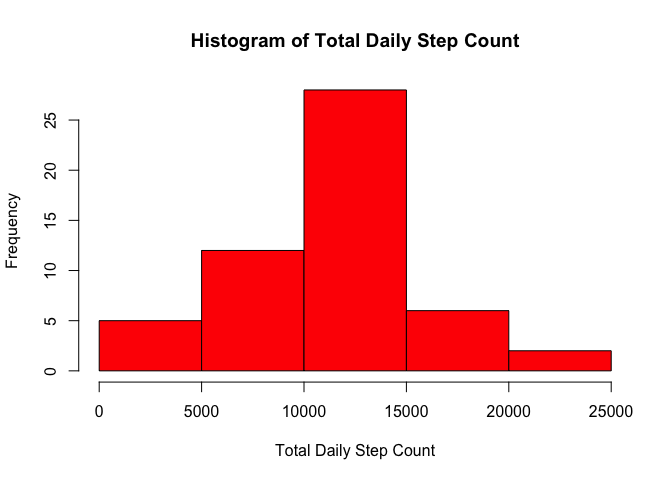
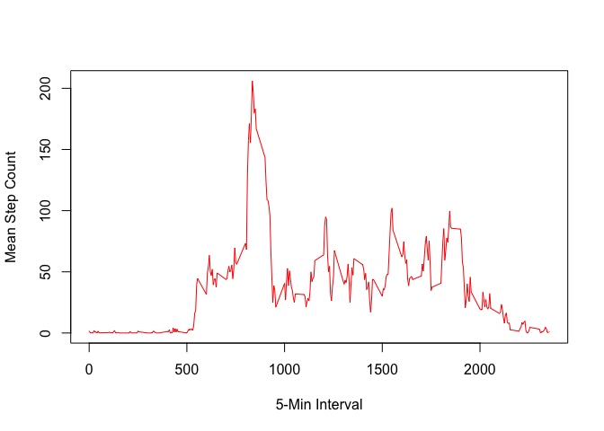
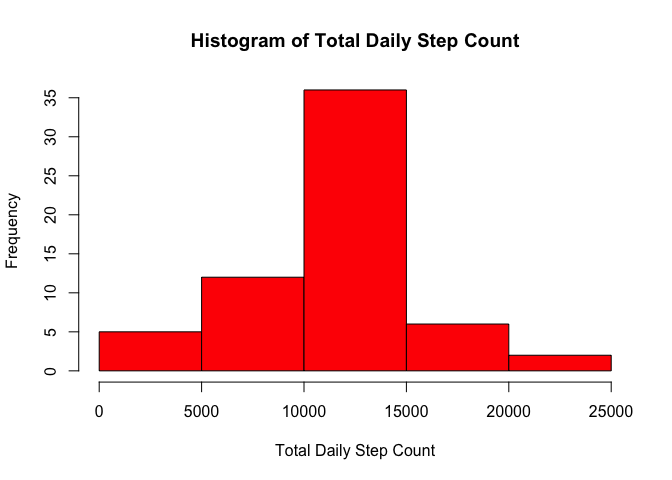
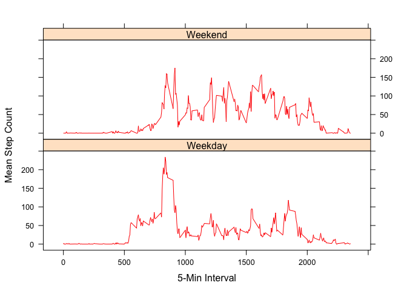

# Reproducible Research: Peer Assessment 1


## Loading and preprocessing the data

##### 1. Load the data (i.e., `read.csv()`).


```r
file.dsin <- "activity.csv"
df.source <- read.csv(file.dsin, header = T)
```

##### 2. Process/transform the data (if necessary) into a format suitable for your analysis


```r
df.dailysum <- aggregate(steps~date, df.source, sum, na.action=na.omit)
df.dailymean <- aggregate(steps~date, df.source, mean, na.action=na.omit)
df.intervalmean <- aggregate(steps~interval, df.source, mean, na.action=na.omit)
```

## What is mean total number of steps taken per day?

##### 1. Make a histogram of the total number of steps taken each day.


```r
steps <- df.dailysum$steps
hist(steps, col="red",
     main="Histogram of Total Daily Step Count",
     xlab="Total Daily Step Count")
```

<!-- -->

##### 2. Calculate and report the mean and median total number of steps taken per day.


```r
mean(steps)
```

```
## [1] 10766.19
```

```r
median(steps)
```

```
## [1] 10765
```

## What is the average daily activity pattern?

##### 1. Make a time series plot (i.e., `type = "l"`) of the 5-minute interval (x-axis) and the average number of steps taken, averaged across all days (y-axis).


```r
x <- df.intervalmean$interval
y <- df.intervalmean$steps
plot(x, y, type="l", col="red",
     xlab="5-Min Interval",
     ylab="Mean Step Count")
```

<!-- -->

##### 2. Which 5-minute interval, on average across all the days in the dataset, contains the maximum number of steps?


```r
df.intervalmean[which.max(y), ]$interval
```

```
## [1] 835
```

## Imputing missing values

##### 1. Calculate and report the total number of missing values in the dataset (i.e., the total number of rows with `NA`s).


```r
sum(is.na(df.source$steps))
```

```
## [1] 2304
```

##### 2. Devise a strategy for filling in all of the missing values in the dataset. The strategy does not need to be sophisticated. For example, you could use the mean/median for that day, or the mean for that 5-minute interval, etc.

As a compromise between the 2 imputation strategies suggested by the author, let's substitute each missing value with its mean daily step count or its mean interval (5-min) step count, whichever value is the smallest.  Merge summary data frames `df.intervalmean` and `df.dailymean` to `df.source` to create a new data frame (`df.imputed`), then apply the custom function `impute` to impute missing `step` values.


```r
impute <- function(x, y, z) {
  ifelse(is.na(x), y, z)
}
```

##### 3. Create a new dataset that is equal to the original dataset but with the missing data filled in.


```r
df.imputed <- merge(df.source, df.intervalmean, by="interval", all=T)
names(df.imputed)[names(df.imputed) == 'steps.x'] <- 'steps'
names(df.imputed)[names(df.imputed) == 'steps.y'] <- 'steps.intervalmean'

df.imputed <- merge(df.imputed, df.dailymean, by="date", all=T)
names(df.imputed)[names(df.imputed) == 'steps.x'] <- 'steps'
names(df.imputed)[names(df.imputed) == 'steps.y'] <- 'steps.dailymean'
head(df.imputed[df.imputed$date == '2012-10-01',])
```

```
##         date interval steps steps.intervalmean steps.dailymean
## 1 2012-10-01        0    NA           1.716981              NA
## 2 2012-10-01     1455    NA          43.773585              NA
## 3 2012-10-01     1325    NA          56.433962              NA
## 4 2012-10-01     2055    NA          20.150943              NA
## 5 2012-10-01     1755    NA          37.452830              NA
## 6 2012-10-01     1030    NA          44.283019              NA
```

```r
df.imputed <- df.imputed[order(df.imputed$date, df.imputed$interval), ]
df.imputed <- transform(df.imputed, steps.imputed = impute(steps, impute(steps.dailymean, steps.intervalmean, min(steps.dailymean, steps.intervalmean)), steps))

head(df.imputed[df.imputed$date == '2012-10-01',])
```

```
##          date interval steps steps.intervalmean steps.dailymean
## 1  2012-10-01        0    NA          1.7169811              NA
## 10 2012-10-01        5    NA          0.3396226              NA
## 19 2012-10-01       10    NA          0.1320755              NA
## 29 2012-10-01       15    NA          0.1509434              NA
## 34 2012-10-01       20    NA          0.0754717              NA
## 41 2012-10-01       25    NA          2.0943396              NA
##    steps.imputed
## 1      1.7169811
## 10     0.3396226
## 19     0.1320755
## 29     0.1509434
## 34     0.0754717
## 41     2.0943396
```

```r
head(df.imputed[df.imputed$date == '2012-10-02',])
```

```
##           date interval steps steps.intervalmean steps.dailymean
## 435 2012-10-02        0     0          1.7169811          0.4375
## 534 2012-10-02        5     0          0.3396226          0.4375
## 320 2012-10-02       10     0          0.1320755          0.4375
## 450 2012-10-02       15     0          0.1509434          0.4375
## 406 2012-10-02       20     0          0.0754717          0.4375
## 355 2012-10-02       25     0          2.0943396          0.4375
##     steps.imputed
## 435             0
## 534             0
## 320             0
## 450             0
## 406             0
## 355             0
```

##### 4. Make a histogram of the total number of steps taken each day. Calculate and report the **mean** and **median** total number of steps taken per day. Do these values differ from the estimates from the first part of the assignment? What is the impact of imputing missing data on the estimates of the total daily number of steps?

Process/transform the imputed data into a format suitable for the analysis.


```r
df.imputed.dailysum <- aggregate(steps.imputed~date, df.imputed, sum)
```

With the summarized imputed data, make a histogram  of the total number of steps taken each day.


```r
steps.imputed <- df.imputed.dailysum$steps.imputed
hist(steps.imputed, col="red",
     main="Histogram of Total Daily Step Count",
     xlab="Total Daily Step Count")
```

<!-- -->

With the summarized imputed data, calculate and report the mean and median total number of steps taken per day.


```r
mean(steps.imputed)
```

```
## [1] 10766.19
```

```r
median(steps.imputed)
```

```
## [1] 10766.19
```

Imputing missing data as I did on the estimates of the total daily number of steps had the following impacts:
* Within 2 decimal places of accuracy, data imputation had no impact on the mean daily step count, but it did slightly increase by about 1.19 steps the median daily step count.  More exactly, it shifted the frequency distribution of the total daily step count such that the mean and median daily step count are equal to within 2 decimal places of accuracy.
* Although the overall shape and centrality of the daily step count remained nearly the same after imputation, the frequency of the most frequently occuring total daily step count (10K <= x < 15K) increased from above 25 to slightly above 35.

## Are there differences in activity patterns between weekdays and weekends?

##### 1. Create a new factor variable in the dataset with two levels -- "weekday" and "weekend" indicating whether a given date is a weekday or weekend day.


```r
weekend <- c('Saturday', 'Sunday')
df.weekdayed <- transform(df.imputed, weekday = weekdays(as.Date(df.imputed$date)))
head(df.weekdayed)
```

```
##          date interval steps steps.intervalmean steps.dailymean
## 1  2012-10-01        0    NA          1.7169811              NA
## 10 2012-10-01        5    NA          0.3396226              NA
## 19 2012-10-01       10    NA          0.1320755              NA
## 29 2012-10-01       15    NA          0.1509434              NA
## 34 2012-10-01       20    NA          0.0754717              NA
## 41 2012-10-01       25    NA          2.0943396              NA
##    steps.imputed weekday
## 1      1.7169811  Monday
## 10     0.3396226  Monday
## 19     0.1320755  Monday
## 29     0.1509434  Monday
## 34     0.0754717  Monday
## 41     2.0943396  Monday
```

```r
df.weekdayed <- transform(df.weekdayed, weekdaytype = ifelse(weekday %in% weekend, 'Weekend', 'Weekday'))
summary(df.weekdayed)
```

```
##          date          interval          steps        steps.intervalmean
##  2012-10-01:  288   Min.   :   0.0   Min.   :  0.00   Min.   :  0.000   
##  2012-10-02:  288   1st Qu.: 588.8   1st Qu.:  0.00   1st Qu.:  2.486   
##  2012-10-03:  288   Median :1177.5   Median :  0.00   Median : 34.113   
##  2012-10-04:  288   Mean   :1177.5   Mean   : 37.38   Mean   : 37.383   
##  2012-10-05:  288   3rd Qu.:1766.2   3rd Qu.: 12.00   3rd Qu.: 52.835   
##  2012-10-06:  288   Max.   :2355.0   Max.   :806.00   Max.   :206.170   
##  (Other)   :15840                    NA's   :2304                       
##  steps.dailymean   steps.imputed         weekday      weekdaytype   
##  Min.   : 0.1424   Min.   :  0.00   Friday   :2592   Weekday:12960  
##  1st Qu.:30.6979   1st Qu.:  0.00   Monday   :2592   Weekend: 4608  
##  Median :37.3785   Median :  0.00   Saturday :2304                  
##  Mean   :37.3826   Mean   : 37.38   Sunday   :2304                  
##  3rd Qu.:46.1597   3rd Qu.: 27.00   Thursday :2592                  
##  Max.   :73.5903   Max.   :806.00   Tuesday  :2592                  
##  NA's   :2304                       Wednesday:2592
```

##### 2. Make a panel plot containing a time series plot (i.e., `type = "l"`) of the 5-minute interval (x-axis) and the average number of steps taken, averaged across all weekday days or weekend days (y-axis).


```r
df.weekdayed.intervalmean <- aggregate(steps~interval+weekdaytype, df.weekdayed, mean)

library(lattice)

xyplot(steps ~ interval | weekdaytype,
       data = df.weekdayed.intervalmean,
       type="l", col="red",
       xlab="5-Min Interval",
       ylab="Mean Step Count",
       layout = c(1,2))
```

<!-- -->
